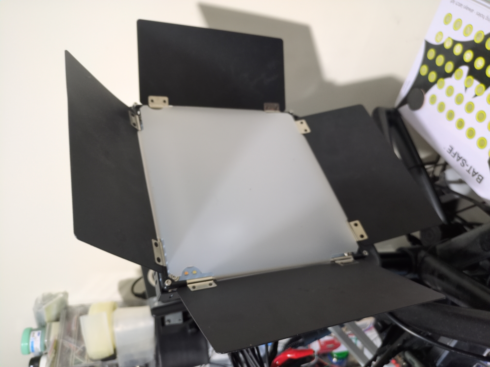
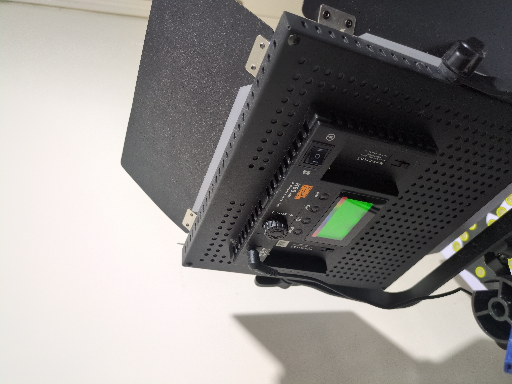
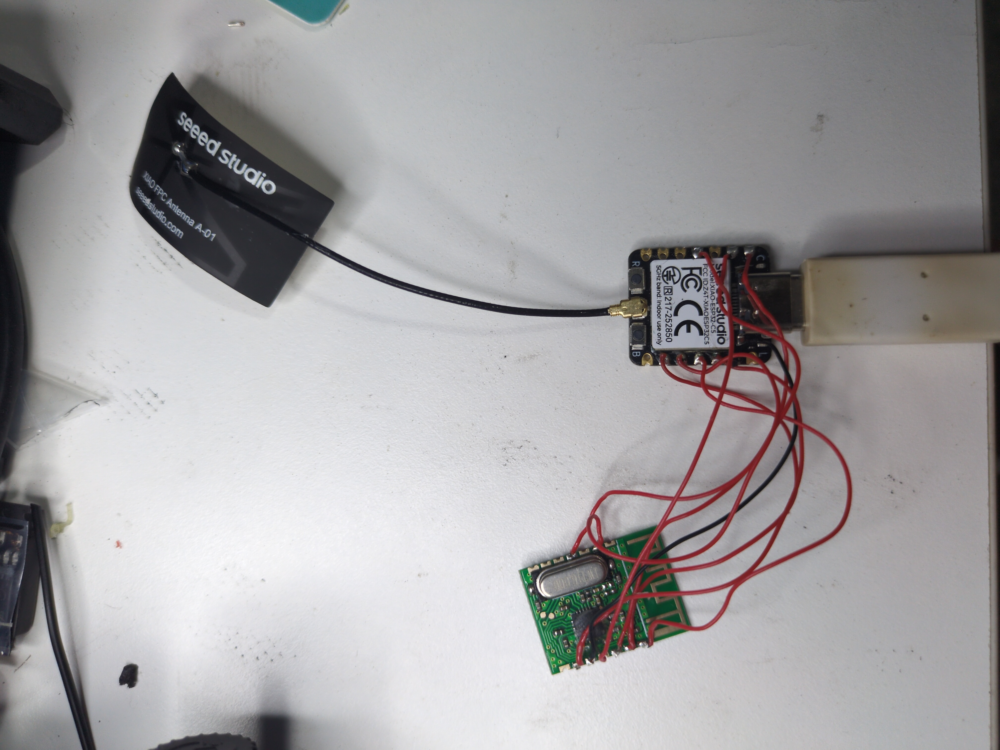
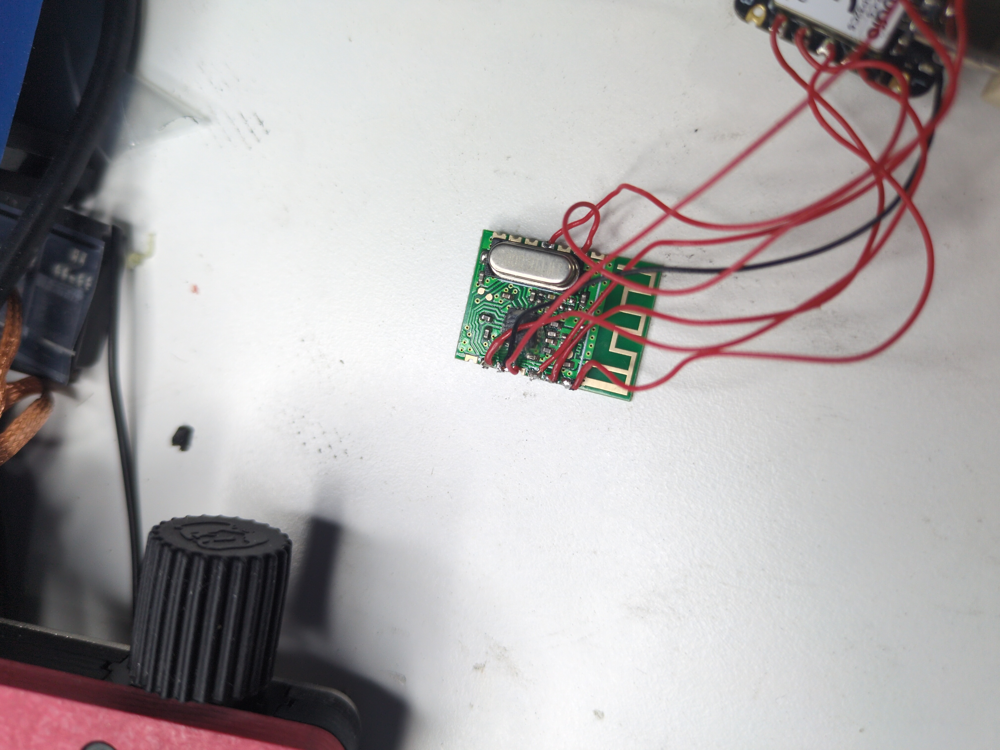

# Yiscaxia / Pixel K80 for ESPHome

An external component that exposes Pixel K80/Yiscaxia RF lights as native
ESPHome lights. The light and packet protocol are separate from the radio
transport. The supplied transport option is `md7105`: an MD7105-SY carrier
with an A7105 radio, using four-wire SPI at **mode 0, 1 MHz**. Other transports
can implement `YiscaxiaTransport`; no other radio backend is currently provided.

## Use

Use the complete [XIAO ESP32-C5 example](examples/xiao-esp32c5.yaml).
Create `examples/secrets.yaml` containing `wifi_ssid` and `wifi_password`,
then run:

```sh
esphome config examples/xiao-esp32c5.yaml
esphome compile examples/xiao-esp32c5.yaml
esphome run examples/xiao-esp32c5.yaml
```

Tested with ESPHome **2026.10.0-dev** and ESP-IDF **5.5.5**. The component
requires ESP32; configure your own board and SPI pins when using another
ESP32 carrier. Add the following to an existing ESPHome configuration, adjusting
the local checkout path:

```yaml
external_components:
  - source:
      type: local
      path: /path/to/esphome-yiscaxia/components
    components: [yiscaxia]

spi:
  id: radio_spi
  clk_pin: GPIO8
  mosi_pin: GPIO10
  miso_pin: GPIO9

yiscaxia:
  id: pixel_controller
  transport:
    type: md7105
    spi_id: radio_spi
    cs_pin: GPIO1
  available_pairs:
    id: pixel_pairs
    name: Available channel and group pairs
  transmission_attempts:
    id: pixel_attempts
    name: Transmission attempts
  channel_spacing:
    id: pixel_spacing
    name: Channel transmission spacing
```

Add `api:` to expose the entities to Home Assistant. Use normal ESPHome API
encryption and OTA authentication for your installation. Each controller creates
its own position lights and the three configuration entities above.
For multiple controllers on one ESPHome device, use distinct controller IDs,
`name_prefix` values and configuration entity names. Equal setting names on
separate ESPHome logical devices use separate preferences; keep those device
IDs and entity names stable to retain saved settings.

Generated light IDs are `<controller_id>_position_<1-based position>`. Built-in
effects work with ordinary static actions as well as API calls:

```yaml
esphome:
  on_boot:
    then:
      - light.turn_on:
          id: pixel_controller_position_1
          effect: SOS
```

## Controls and saved settings

| Control | Behavior |
| --- | --- |
| Position light | ON/OFF, brightness, RGB and 2600–10000 K CCT in 100 K wire steps |
| Native effects | SOS, Lightning 1, Lightning 2, TV Screen, Police, Ambulance, Fire Engine, RGB Circle 1, RGB Circle 2 |
| None | Static RGB/CCT; OFF preserves the desired color for the next ON |
| Slow Rainbow | Host advances hue by 1° each second; skips while that position has pending manual traffic |
| Available pairs | Ordered unique pairs such as `1A,2B,2D`: channel 1–48 and group A–F |
| Transmission attempts | Total manual/native attempts, **1–255**, default **3**; automatic Rainbow phases always use **1** |
| Channel transmission spacing | Minimum TX-start gap per RF channel, **1–65535 ms**, default **150 ms** |

The pool has **12** positions by default; set `position_capacity: 6..64`
and `name_prefix: Pixel K80` under `yiscaxia:` to change its size/names.
The initial table is `1A,1B,1C,1D,1E,1F`; override it with `initial_pairs:`.
Each table entry addresses the corresponding position light. For example,
`1A,-,2D` enables positions 1 and 3, keeping position 2 disabled.
Omitted positions are disabled; an empty string disables all; trailing `-`
entries are trimmed. No spaces, lowercase groups, leading zeros, duplicate
pairs, or trailing commas are accepted. Changed positions must be **OFF and
idle**, including completion of pending OFF attempts and transitions.

RF transmission is serial. Groups on the same channel share its spacing clock;
eligible other channels can progress during that wait. Channels and positions
are served fairly. A newer desired state replaces pending attempts; identical
pending state does not restart them. Large spacing values can delay OFF.

Pair and transmission edits are saved immediately. Rejected edits keep the
previous value; persistence failures report a warning/status and attempt to
retain it, but durable state is uncertain after a storage failure. Native
ESPHome light restore persists manual state through `preferences.flash_write_interval`
(default **60s**). Wait for that interval before removing power if the latest
manual state must survive. Pair/Number edits explicitly sync storage. Automatic
Rainbow phases use `set_save(false)` and do not write flash or publish every phase. On restart,
restore is drained with RF muted before restored ON states are transmitted.
Keep entity names and logical device IDs stable to retain preference identity.
`id(pixel_pairs).configuration_status()`,
`id(pixel_attempts).configuration_status()` and
`id(pixel_spacing).configuration_status()` are available to template
diagnostics; the pairs entity also provides `format_description()`.

State means **requested**, not lamp acknowledged. This is a reverse-engineered
protocol: captured native behavior supports the implementation, but channel
1–48 addressing uses a frequency model and does not establish every fixture,
channel or emitted effect pattern. Verify the intended lamp and non-target
lamps when commissioning.

## Minimal MD7105-SY wiring

This map is for the identified **14-pad carrier**, component side up,
printed antenna pointing right. Pin 1 is top-right and pin 14 bottom-right.
It is not an eight-pin module map. XIAO orientation: front/silkscreen facing
you, USB-C at the top.

```text
MD7105-SY component side                         antenna →
top pads:       7     6     5     4     3     2     1
               GND             GIO2        GIO1
               ┌────────────────────────────────┐
               │       crystal / radio          │
               └────────────────────────────────┘
bottom pads:    8     9    10    11    12    13    14
                    VDD   GND        SCS   SCK  SDIO
```

| MD7105-SY numbered pad | XIAO ESP32-C5 |
| --- | --- |
| 7 / 10 — GND | GND, header 13 |
| 9 — VDD | 3V3, header 12 |
| 12 — SCS/CSN | D0 / GPIO1, header 1 |
| 13 — SCK | D8 / GPIO8, header 9 |
| 14 — SDIO/SDI | D10 / GPIO10, header 11 |
| 2 — GIO1/SDO | D9 / GPIO9, header 10 |

The TX backend polls status over SPI, so GIO2/FSYNC and chip-pin-18 CKO are
unnecessary. If reusing the investigation harness, its existing GIO2/CKO
wires are not configured by this component.
Use **3.3 V**, common ground and 3.3 V signals. Disconnect power before wiring
or soldering; connect ground first and VDD last; never use 5 V/VBUS.
Verify orientation against your actual carrier before using these pad numbers.

Pin provenance: the source project's
[working carrier guide](https://github.com/xaionaro/my-devices/blob/main/k80/md7105-wiring.md)
and [Seeed XIAO ESP32-C5 documentation](https://wiki.seeedstudio.com/xiao_esp32c5_getting_started/).

## Hardware photos

Pixel K80 RGB light: front and rear controls.

<a href="docs/photos/IMG_20261004_204606_309.jpg"></a>
<a href="docs/photos/IMG_20261004_204612_264.jpg"></a>

XIAO ESP32-C5 connected to the MD7105-SY, and a close-up of the radio module.
The prototype includes extra investigation wires; only the connections in the
minimal wiring table above are required by this component.

<a href="docs/photos/IMG_20261004_204655_511.jpg"></a>
<a href="docs/photos/IMG_20261004_204706_565.jpg"></a>

## Development and provenance

```sh
cmake -S . -B build
cmake --build build -j
ctest --test-dir build --output-on-failure

# Also exercise the installed SDK and real schema/code generation:
cmake -S . -B build-full -DYISCAXIA_FULL_CHECKS=ON \
  -DESPHOME_EXECUTABLE=/path/to/venv/bin/esphome \
  -DESPHOME_SDK_ROOT=/path/to/venv/lib/python3.13/site-packages
cmake --build build-full -j
ctest --test-dir build-full --output-on-failure
```

The default checks cover pure protocol/conversion/table/scheduling behavior.
Full checks additionally run the actual SDK light/configuration calls,
controller, persistence failure/reboot cases, MD7105 adapter and CLI schema/codegen.
They do not replace RF hardware checks.

`components/yiscaxia/__init__.py` validates configuration and generates native
entities; the controller/light/configuration classes own per-instance state.
`YiscaxiaTransport` separates that policy from the MD7105 SPI backend and pure
packet/transaction headers. `tests/` checks each layer and its SDK integration.
